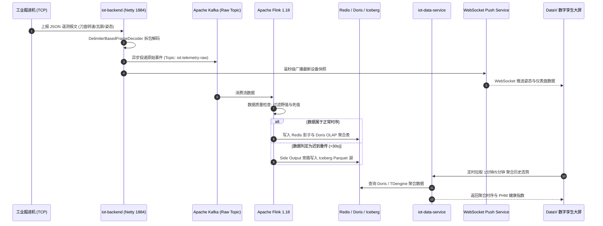

# 02. 系统架构与技术方案演进 (Architecture Evolution)

> **文档版本**：v2.2.0 (Release)  
> **编制角色**：System Architect (系统架构师)  
> **架构核心**：边缘高并发接入 + Flink 毫秒级流清洗 + 湖仓一体分层存储 + AI 工业中枢 + DataV 数字孪生大屏  

---

## 1. 系统总体架构演进全景

本项目技术架构经历了从早期**单体后端直连数据库**到当前**企业级高并发实时湖仓一体化与数字孪生架构**的深度演进：

```mermaid
graph TB
    subgraph EdgeLayer [1. 边缘设备与数据采集层]
        TCP_DEV[矿井掘进机 / 传感器<br>Netty TCP 协议 1884]
        MQTT_DEV[环境监测节点 / 瓦斯传感器<br>EMQX MQTT 1883]
        SIM_DEV[Python 高并发压测发生器<br>bigdata_simulator.py]
    end

    subgraph MsgLayer [2. 消息高吞吐缓冲层]
        EMQX_RULE[EMQX 规则引擎]
        KAFKA_RAW[Apache Kafka 消息集群<br>Topic: iot-telemetry-raw / 32 Partitions]
    end

    subgraph StreamLayer [3. 实时流计算引擎 (Flink 1.18)]
        FLINK_JOB[TelemetryStreamApp 分布式作业]
        FLINK_CLEAN[数据质量清洗: 死值/卡死/物理野值过滤]
        FLINK_LATE[迟到重传数据 Side Output 旁路分道]
        FLINK_WIN[1分钟/5分钟 滑动窗口实时多维聚合]
    end

    subgraph StorageLayer [4. 湖仓一体分层存储矩阵 (Lakehouse)]
        REDIS[(Redis 7.0<br>热数据/设备影子 毫秒级)]
        TDENGINE[(TDengine 3.0<br>超高频时序时空库)]
        DORIS[(Apache Doris 2.0<br>温数据/实时多维 OLAP)]
        ICEBERG[(MinIO + Apache Iceberg<br>冷数据/历史湖 Parquet 列存)]
    end

    subgraph ServiceLayer [5. 统一数据服务中台与业务中枢 (Spring Boot 3.4)]
        DATA_SVC[iot-data-service<br>OneData 统一指标服务 / PHM / RUL]
        BACKEND[iot-backend<br>设备生命周期 / 权限 / 告警引擎]
        AI_GW[AI 工业智能诊断网关<br>Gemini / OpenAI API 兼容协议]
        WS_SVC[WebSocket / STOMP<br>毫秒级大屏数据广播通道]
    end

    subgraph AppLayer [6. 前端数字孪生与大屏指挥中心 (Vue 3 + TS)]
        DASHBOARD[DataV 掘进机数字孪生指挥大屏<br>DashboardView.vue 方案B布局]
        BIGDATA_VIEW[大数据流与湖仓态势大屏<br>BigDataDashboardView.vue]
        AI_VIEW[AI 工业智能诊断中枢<br>AiAssistantView.vue 多轮对话]
        DEVICE_MGMT[设备资产与全生命周期管理<br>DeviceListView.vue]
    end

    TCP_DEV -->|长连接 JSON 报文| BACKEND
    MQTT_DEV -->|MQTT QoS 1| EMQX_RULE
    SIM_DEV -->|海量数据压测| KAFKA_RAW
    EMQX_RULE -->|无损直通| KAFKA_RAW
    BACKEND -->|TCP 遥测转储| KAFKA_RAW

    KAFKA_RAW --> FLINK_JOB
    FLINK_JOB --> FLINK_CLEAN
    FLINK_CLEAN --> FLINK_WIN
    FLINK_CLEAN -->|迟到数据旁路| ICEBERG
    FLINK_WIN --> DORIS
    FLINK_CLEAN --> REDIS
    FLINK_CLEAN --> TDENGINE

    REDIS --> DATA_SVC
    DORIS --> DATA_SVC
    TDENGINE --> DATA_SVC
    ICEBERG --> DATA_SVC

    DATA_SVC --> REST_API[RESTful OpenAPI]
    BACKEND --> WS_SVC
    AI_GW <--> LLM[(大语言模型<br>DeepSeek / Gemini / Ollama)]

    REST_API --> DASHBOARD
    WS_SVC --> DASHBOARD
    WS_SVC --> BIGDATA_VIEW
    AI_GW --> AI_VIEW
    REST_API --> DEVICE_MGMT

    style EdgeLayer fill:#f0f4c3,stroke:#9e9d24,stroke-width:2px;
    style MsgLayer fill:#ffe0b2,stroke:#f57c00,stroke-width:2px;
    style StreamLayer fill:#e1bee7,stroke:#8e24aa,stroke-width:2px;
    style StorageLayer fill:#bbdefb,stroke:#1976d2,stroke-width:2px;
    style ServiceLayer fill:#c8e6c9,stroke:#388e3c,stroke-width:2px;
    style AppLayer fill:#ffcdd2,stroke:#d32f2f,stroke-width:2px;
```

---

## 2. 六大核心架构层级详解

### 2.1 边缘采集与通信网关层 (Edge Ingestion)
- **Netty TCP 工业网关 (Port: 1884)**：
  - 基于高性能 Netty 4.1 构建非阻塞 I/O 服务端，支持 10,000+ 工业设备并发长连接。
  - **帧协议设计**：采用换行符定界 JSON 行协议，集成 `DelimiterBasedFrameDecoder(4096, Delimiters.lineDelimiter())`，彻底消除由于网络抖动引发的粘包、拆包问题。
  - **双向操控链路**：下行指令优先尝试 TCP 直连通道，离线状态自动无缝降级至 MQTT 异步消息队列。
- **EMQX 物联网消息中间件 (Port: 1883)**：
  - 承载千万级 MQTT 遥测上报，内置规则引擎将主题 `iot/+/telemetry` 数据无损零拷贝直推 Kafka。

### 2.2 实时流计算引擎层 (Flink 1.18 Engine)
- **实时数据质量清洗 (Quality Process Function)**：
  - **死值/卡死检测 (Flatline Detection)**：对传感器连续 $M$ 帧未发生微小方差变化的异常数据标记为卡死，避免下游生成错误均值。
  - **物理超限野值过滤 (Wild Value Filter)**：结合设备物理量程范围（如矿井温度 $[ -20^\circ	ext{C}, 100^\circ	ext{C} ]$，瓦斯 $[ 0\%, 10\% ]$）实时阻断越界数据。
- **迟到重传数据旁路分道 (Side Output Pattern)**：
  - 设置 Watermark 允许最大迟到时间为 $30	ext{s}$。
  - 正常时序进入实时滑动窗口；因矿井网络短暂中断重传的历史数据，通过 Side Output 旁路直写 MinIO/Iceberg 湖仓，保证实时计算不被阻塞。
- **滑动窗口实时多维聚合**：
  - 划分 1 分钟、5 分钟滑动窗口，计算均值、峰值、方差及累计运行功耗，秒级批量写入 Doris 聚合表。

### 2.3 湖仓一体分层存储层 (Lakehouse Multi-Tier Storage)
针对工业大数据“高频写入、冷热鲜明、时序为主、多维分析”的特征，建立四层存储架构：

| 存储层级 | 技术选型 | 数据生命周期 | 访问延迟 | 典型应用场景 |
| :--- | :--- | :--- | :--- | :--- |
| **热数据层 (Hot Tier)** | Redis 7.0 / Memory | 0 ~ 7 天 | $< 5	ext{ms}$ | 设备最新实时影子、大屏即时指标、高频指令缓存 |
| **时序层 (TS Tier)** | TDengine 3.0 | 0 ~ 30 天 | $< 20	ext{ms}$ | 传感器超高频秒级时序波形回放、历史曲线分析 |
| **温数据层 (Warm Tier)** | Apache Doris 2.0 | 8 ~ 90 天 | $< 100	ext{ms}$ | 设备综合效率 (OEE)、矿区能耗分析、实时 OLAP 聚合 |
| **冷数据湖 (Cold Lake)** | MinIO + Apache Iceberg | 90 天 ~ 3 年 | 批量查询 | 离线算法训练、全量审计归档、设备剩余寿命 (RUL) 深度挖掘 |

### 2.4 统一数据服务中台与业务中枢 (OneData API & Backend)
- **`iot-data-service` (OneData 中台)**：
  - 对上层屏蔽底层 Redis、TDengine、Doris、Iceberg 的技术异构性，提供统一标准 RESTful OpenAPI。
  - 内置设备健康度评估算法（PHM）与关键部件磨损预测模型。
- **`iot-backend` (业务与告警中枢)**：
  - 集成 `MethaneAlertService` 瓦斯防抖告警引擎，基于多帧滑动窗口识别真实超限并持久化去重。
  - 集成 Spring WebSocket & STOMP 广播协议，秒级向大屏推送掘进机姿态与环境遥测。
- **AI 工业智能诊断网关 (`AiController`)**：
  - 适配 OpenAI 标准 API 接口规范，兼容 DeepSeek、Google Gemini、Qwen、本地 Ollama 多类大模型。
  - 支持会话上下文注入工业专家知识库与当前设备遥测快照。

### 2.5 前端数字孪生大屏指挥层 (DataV Command Center)
- **技术栈**：Vue 3.4 + TypeScript + Vite 5 + Pinia + ECharts 5 + DataV-Vue3。
- **核心视图体系**：
  - `DashboardView.vue`：方案B经典指挥大屏（左侧环境与告警、中间掘进机 2D/3D 数字孪生与控制台、右侧生产效能与大数据流态势）。
  - `AiAssistantView.vue`：全屏嵌入式 AI 智能诊断 Copilot，支持多模型热拉取与 LocalStorage 配置持久化。
  - `BigDataDashboardView.vue`：湖仓全景吞吐量、Flink 任务拓扑与分层存储态势大屏。

---

## 3. 核心数据链路时序流 (Sequence Diagram)


