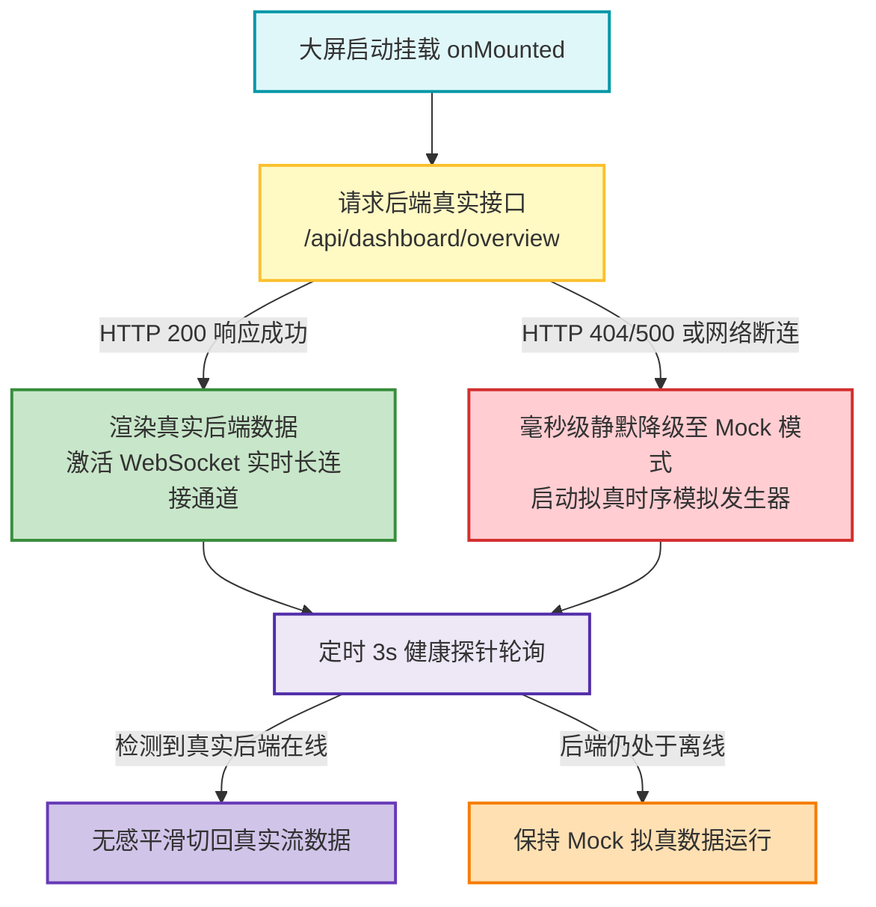

# 04. AI 智能中枢与数字孪生大屏重构专刊 (Feature Deep Dive)

> **文档版本**：v2.2.0 (Release)  
> **编制角色**：Product Manager & Full-Stack Engineer  
> **核心专题**：掘进机数字孪生中台 (方案B) + DataV 科技指挥风 + AI 工业诊断中枢 + 真实/Mock 双模驱动  

---

## 1. 掘进机数字孪生大屏方案 B 重构

在历次产品迭代中，监控大屏经历了从“通用物联网表格卡片”到“**智慧矿山综采作业区经典三栏指挥中心（方案B）**”的全面重构与视觉跃迁。

```mermaid
graph LR
    subgraph LeftCol [左侧 28%：矿井安全感知态势]
        L1[瓦斯 CH4 浓度实时趋势折线图]
        L2[一氧化碳 CO / 硫化氢 浓度监测]
        L3[巷道温湿度与风速环境指标]
        L4[多级安全告警即时动态流水]
    end

    subgraph MidCol [中间 44%：掘进机数字孪生中台]
        M1[掘进机高清透视结构孪生视图]
        M2[截割头转速 / 推进速度 / 姿态陀螺仪]
        M3[液压主泵压力表 / 截割臂伸缩行程]
        M4[紧急一键启停 / 模式切换操控台]
    end

    subgraph RightCol [右侧 28%：生产效能与大数据态势]
        R1[今日开挖进尺目标达成率仪表盘]
        R2[设备综合健康度 PHM / 剩余寿命预测]
        R3[Flink 1.18 实时流吞吐量监测]
        R4[Doris / Iceberg 湖仓入库速率统计]
    end

    LeftCol --- MidCol --- RightCol
    
    style LeftCol fill:#e8eaf6,stroke:#3f51b5,stroke-width:2px;
    style MidCol fill:#e0f2f1,stroke:#00897b,stroke-width:2px;
    style RightCol fill:#fff8e1,stroke:#ffa000,stroke-width:2px;
```

### 1.1 经典三栏布局与核心组件设计

1. **左侧安全态势栏（Safety Perception）**：
   - **瓦斯趋势图**：基于 ECharts 渐变面积折线图实时绘制，以 $1.0\%$ 为警戒红线（标定 MarkLine），以 $0.8\%$ 为预警黄线。
   - **动态告警流**：卡片固定高度与内嵌滚动条，采用多级严重性徽标（红色 CRITICAL、橙色 WARNING、蓝色 INFO）。
2. **中间数字孪生中台（Digital Twin Hub）**：
   - **居中高保真孪生投影**：加载 `roadheader.png` 掘进机透视图，并叠加 6 个传感器热区标定点（截割头温度、主电机电流、液压泵油压、回转角度等）。
   - **六向姿态陀螺仪**：直观反映掘进机的俯仰角（Pitch）、滚转角（Roll）和偏航角（Yaw），辅助远程司机纠偏。
   - **远程遥控指令区**：提供“截割启动/停止”、“刀盘加压”、“喷雾降尘”、“紧急制动”等操作，并显示指令下发状态与回执时延。
3. **右侧大数据与效能栏（Efficiency & BigData Stream）**：
   - **生产进度看板**：展示实际进尺与计划进尺对比，换班作业统计。
   - **湖仓吞吐态势**：展示 Flink 当前秒级计算延迟（$< 1.2\text{s}$）、Kafka 积压量（Lag）以及 Iceberg 冷湖已归档数据量。

---

## 2. DataV 政企科技指挥风 UI 体系升级

大屏全面融合政企科技指挥中心的视觉设计语言，实现了从“普通管理端”到“高沉浸大屏指挥中心”的质感升级：

1. **色彩与质感矩阵**：
   - **主背景基调**：深度太空蓝与暗晶石黑 `#060d1f`，营造深邃旷远的工业科技空间感。
   - **主辅强调色**：霓虹极光青 `#00f0ff`（遥测正常）、激光蓝 `#1890ff`（流计算链路）、琥珀金 `#faad14`（生产指标）、警报红 `#ff4d4f`（超限告警）。
   - **容器材质**：采用高透毛玻璃效果（`backdrop-filter: blur(12px)`）搭配 HUD（平视显示器）风格的科技四角切角边框。
2. **全自适应与响应式保障**：
   - 支持 $1920 \times 1080$、$2560 \times 1440$ 以及 $3840 \times 2160$ (4K) 各种主流大屏比例。
   - 彻底重构全屏自适应逻辑，监听 `fullscreenchange` 与 `window.resize`，在 DOM 尺寸完全沉降后自适应触发图表 `chart.resize()`。

---

## 3. 双模数据驱动机制 (Real-First + Mock Fallback)

为兼顾实战生产部署与离线演示评审，设计了**双模自愈式数据管道**：

- **真实模式（Real Mode）**：
  - 自动向 `iot-backend` 发起 REST 请求并建立 WebSocket 连接，直接消费 Netty 采集并经过 Flink 清洗后的工业真实遥测流。
- **Mock 兜底模式（Mock Fallback Mode）**：
  - 基于高斯白噪声与工业运行特征曲线（如转速平稳波动于 $1400 \sim 1500\text{rpm}$，瓦斯稳定在 $0.3\% \sim 0.6\%$），确保在评委离线审查或网络隔绝环境下大屏始终具备高度逼真的动态演示效果。

---

## 4. AI 工业智能诊断中枢设计 (`AiAssistantView`)

针对工业现场设备故障代码复杂、排障手册检索慢的痛点，打造了专为工业物联网赋能的 **AI 工业智能诊断 Copilot**：

```mermaid
graph LR
    subgraph FrontEnd [前端 AI 交互中枢]
        CHAT_UI[多轮对话工作台<br>Markdown / 代码高亮 / 一键复制]
        MODEL_MGR[模型热拉取与切换<br>LocalStorage 本地持久化]
        SNAPSHOT_INJECT[设备遥测快照一键注入]
    end

    subgraph Gateway [Spring Boot 调度网关]
        AI_CTRL[AiController.java<br>统一适配层]
        PROMPT_ENG[工业故障排障 Prompt 模版工程]
    end

    subgraph LLM_Providers [多模型支持矩阵]
        OLLAMA[本地私有化 Ollama<br>DeepSeek-R1 / Qwen2.5]
        CLOUD_GEMINI[Google Gemini API]
        CLOUD_OPENAI[OpenAI / 兼容第三方端点]
    end

    FrontEnd <-->|REST API / SSE 流式| Gateway
    Gateway <-->|HTTP 客户端| LLM_Providers

    style FrontEnd fill:#e3f2fd,stroke:#1565c0,stroke-width:2px;
    style Gateway fill:#e8f5e9,stroke:#2e7d32,stroke-width:2px;
    style LLM_Providers fill:#f3e5f5,stroke:#7b1fa2,stroke-width:2px;
```

### 4.1 核心特性与技术亮点

1. **全协议兼容的多模型提供商**：
   - 深度支持 **Google Gemini、OpenAI、DeepSeek、本地 Ollama** 等多类主流模型协议。
   - 提供“拉取模型列表（Pull Models）”功能，支持一键探测本地 Ollama 已加载的模型（如 `deepseek-r1:7b`, `llama3:8b`）并自动填充到模型选择下拉框。
2. **状态与配置本地持久化 (Persistent LocalStorage)**：
   - 彻底解决切换预设或重新加载页面导致的已拉取模型丢失问题。
   - 对 API Key 进行安全掩码处理，既保障了敏感凭据安全，又避免了频繁重复配置。
3. **设备遥测实时快照一键注入 (Context Snapshot Injection)**：
   - 支持一键将当前矿井的“掘进机转速、电机温升、瓦斯浓度、液压油压”打包为标准 JSON 注入 Prompt 上下文，大模型能够精准分析当前是否存在轴承干磨、瓦斯积聚或液压内泄隐患，并输出标准排障 SOP。
4. **企业级 Markdown 与 XSS 安全渲染**：
   - 集成 `marked` 语法解析与 `highlight.js` 代码高亮，结合 `DOMPurify` 执行严格的安全白名单清洗，杜绝任何 XSS 脚本注入风险。
