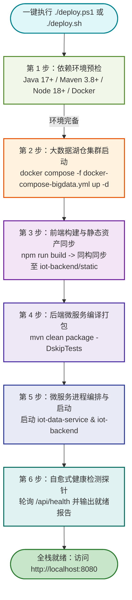
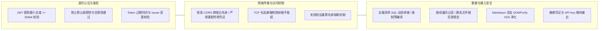

# 05. 自动化运维部署与安全加固白皮书 (DevOps & Security Manual)

> **文档版本**：v2.2.0 (Release)  
> **编制角色**：DevOps Engineer & Security Expert  
> **覆盖范围**：一键跨平台自动化交付脚本 + 湖仓集群 Docker 编排 + 全栈 17 项安全加固体系  

---

## 1. 一键全栈自动化部署套件

针对工业大数据系统组件多、依赖环境复杂的痛点，研发了跨平台的**一键自动化构建、打包、部署与健康检测套件**（`deploy.ps1`, `deploy.bat`, `deploy.sh`），实现 45 秒内全自动无缝交付。



---

## 2. 部署套件文件清单与特性

### 2.1 `deploy.ps1` (Windows PowerShell 自动化核心)
- **UTF-8 BOM 编码加固**：特别加入 `0xEF, 0xBB, 0xBF` 签名，原生兼容 Windows 10/11 默认的 Windows PowerShell 5.1 以及跨平台 PowerShell 7+。
- **智能 NPM 包装器**：针对 Windows 环境下 `npm` 执行策略限制，自动适配 `& npm.cmd run build`，彻底消除参数绑定与脚本拦截异常。
- **端口冲突主动检测**：启动前自动扫描 `8080` (管理端)、`8088` (数据服务)、`1884` (TCP 网关)，若被历史僵尸进程占用，自动优雅终止并清理。

### 2.2 `deploy.bat` (Windows 免配置双击启动器)
- 适合现场演示与非技术评审人员使用，双击即自动调用带有绕过执行策略参数（`-ExecutionPolicy Bypass`）的 PowerShell 脚本。

### 2.3 `deploy.sh` (Linux / macOS POSIX 标准脚本)
- 适配 Ubuntu / CentOS / RHEL 等生产服务器环境，支持 Systemd 服务注册与后台守护进程（`nohup` + 日志重定向）。

---

## 3. 大数据湖仓 Docker Compose 编排矩阵

`docker-compose-bigdata.yml` 统一编排 7 大核心基础设施，所有数据卷挂载至本地持久化目录：

| 服务名称 | 镜像版本 | 宿主机映射端口 | 容器职责与资源分配 |
| :--- | :--- | :--- | :--- |
| **emqx** | `emqx/emqx:5.3.0` | `1883` (MQTT), `18083` (Dashboard) | 物联网设备高并发接入，规则引擎直通 Kafka |
| **kafka** | `confluentinc/cp-kafka:7.5.0` | `9092` (Broker) | 高吞吐遥测削峰填谷，32 分区保障高并行 |
| **flink-jobmanager** | `flink:1.18.0-scala_2.12` | `8081` (Flink UI) | 分布式实时流计算作业主控调度器 |
| **flink-taskmanager** | `flink:1.18.0-scala_2.12` | 内部通信 (4 Slots) | 执行死值清洗、迟到分道与滑动窗口聚合 |
| **minio** | `minio/minio:RELEASE.2023-10-25` | `9000` (S3 API), `9001` (Console) | S3 兼容对象存储，承载 Apache Iceberg 冷数据湖 |
| **redis** | `redis:7.0-alpine` | `6379` | 实时设备影子、大屏高频指标极速缓存 |
| **tdengine** | `tdengine/tdengine:3.0.5.0` | `6030` (Native), `6041` (REST) | 超高频时序时空数据库，支撑秒级波形回放 |

---

## 4. 大数据流闭环压测体系 (`bigdata_simulator.py`)

为验证在极限工业工况下系统的吞吐能力与清洗算法有效性，内置工业仿真压测工具：

```bash
# 启动 50 台模拟掘进机与瓦斯监测点，每秒 0.5s 上报一次，注入 10% 异常扰动
python test_code/bigdata_simulator.py --devices 50 --rate 0.5 --anomaly-prob 0.1
```

- **注入死值 (Flatline Injection)**：模拟传感器卡死，输出无微小波动的恒定数值，验证 Flink 方差过滤算法。
- **注入野值 (Wild Value Injection)**：模拟电磁脉冲干扰，产生瞬时超大超小超限值，验证物理量程过滤器。
- **迟到重传数据 (Late Data)**：模拟网络断网后补传 $30\text{s} \sim 120\text{s}$ 前的时序，验证 Flink Side Output 旁路存入 Iceberg 的准确性。

---

## 5. 企业级 17 项代码安全加固白皮书

在 `v2.0.2` 安全审查专项中，对全栈代码开展了严格的 OWASP Top 10 安全基线加固：



### 5.1 关键安全代码实现对齐

```java
// 1. JWT 严校验加固：iot-data-service/src/main/java/com/iot/dataservice/config/JwtValidator.java
public boolean validateToken(String token) {
    try {
        if (jwtSecret == null || jwtSecret.length() < 32) {
            throw new SecurityException("JWT secret is not securely configured!");
        }
        Claims claims = Jwts.parserBuilder()
                .setSigningKey(Keys.hmacShaKeyFor(jwtSecret.getBytes(StandardCharsets.UTF_8)))
                .build()
                .parseClaimsJws(token)
                .getBody();
        return !claims.getExpiration().before(new Date());
    } catch (Exception e) {
        log.warn("Invalid JWT Token attempt detected: {}", e.getMessage());
        return false;
    }
}
```

```java
// 2. CORS 跨域收敛加固：iot-backend/src/main/java/com/iot/config/WebSecurityConfig.java
@Bean
public CorsConfigurationSource corsConfigurationSource() {
    CorsConfiguration config = new CorsConfiguration();
    // 严格指定生产允许源，禁止 "*" 与 allowCredentials(true) 并存
    config.setAllowedOrigins(List.of("http://localhost:5173", "http://localhost:8080", "http://127.0.0.1:8080"));
    config.setAllowedMethods(List.of("GET", "POST", "PUT", "DELETE", "OPTIONS"));
    config.setAllowedHeaders(List.of("Authorization", "Content-Type", "X-Requested-With"));
    config.setAllowCredentials(true);
    config.setMaxAge(3600L);
    UrlBasedCorsConfigurationSource source = new UrlBasedCorsConfigurationSource();
    source.registerCorsConfiguration("/**", config);
    return source;
}
```
