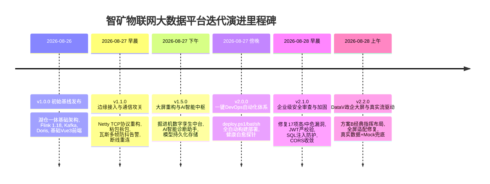
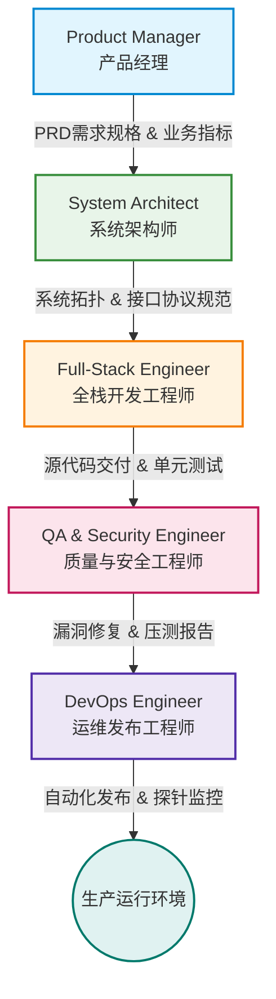

# IoT 工业大数据与实时湖仓一体化平台 - 项目迭代与演进全景白皮书

> **文档版本**：v2.2.0 (Release)  
> **编制标准**：MetaGPT 软件工程协作规范 & Ponytail 端到端全链路追溯标准  
> **编制角色**：Product Manager / System Architect / Full-Stack Engineer / QA & Security Engineer / DevOps Engineer  
> **项目名称**：IoT BigData & Lakehouse Platform (物联网大数据与湖仓一体化平台 / 智矿数字孪生指挥中心)  
> **最后更新时间**：2026-08-28  

---

## 1. 项目演进全景总览

本项目是一个面向现代工业物联网（IIoT）、智慧矿山与数字化车间的高并发、高可用**实时湖仓一体化与数字孪生大屏指挥平台**。在历次对话与版本迭代中，团队针对**边缘TCP/MQTT接入、Flink分布式流计算、Doris/Iceberg实时湖仓、AI工业诊断中枢、DataV政企指挥大屏、自动化DevOps与企业级安全加固**进行了全方位的重构与演进。

---

## 2. MetaGPT 多角色工程协同机制

在整个项目研发与重构生命周期中，严格践行 **MetaGPT 标准软件工程协作（SOP）机制**，各角色职责与产出对齐如下：

1. **产品经理 (Product Manager)**：
   - 提炼智慧矿山大屏、掘进机数字孪生、瓦斯超限多级预警、AI助手多轮诊断的核心业务需求。
   - 制定交互逻辑标准（如卡片防抖动、真实优先+Mock兜底双模机制、政企科技蓝视觉风格）。
2. **系统架构师 (System Architect)**：
   - 设计 **边缘接入 (Netty TCP/EMQX) -> 高吞吐缓冲 (Kafka) -> 实时流计算 (Flink 1.18) -> 分层湖仓 (Redis/TDengine/Doris/Iceberg) -> 统一指标中台 (OneData API) -> 响应式大屏** 的六层技术架构。
   - 制定前后端通信报文标准与 WebSocket 实时广播协议。
3. **全栈开发工程师 (Full-Stack Engineer)**：
   - **后端实现**：基于 Spring Boot 3.4 编写 Netty FrameDecoder、瓦斯防抖算法 `MethaneAlertService`、AI 调度网关 `AiController`。
   - **前端开发**：基于 Vue 3 + TypeScript + Pinia + ECharts 构建 `DashboardView.vue` 方案B经典三栏布局与 `AiAssistantView.vue` 模型配置中枢。
4. **质量与安全工程师 (QA & Security Engineer)**：
   - 覆盖单元测试与压测基准（`bigdata_simulator.py` 注入死值/迟到流压测）。
   - 深度开展代码安全审查，修复包括 JWT 验证绕过、SQL 注入、CORS 泛通配、敏感 Key 明文存储等在内的 17 项漏洞。
5. **运维发布工程师 (DevOps Engineer)**：
   - 编排跨平台自动化构建部署套件（`deploy.ps1`, `deploy.bat`, `deploy.sh`）。
   - 解决 Windows PowerShell 5.1 BOM 兼容性与 NPM 参数绑定异常，实现一键全栈自愈式发布。

---

## 3. 日志体系目录导航

本文件夹（`项目迭代跟新日志`）严格按照模块化、可追溯的标准组织，涵盖项目从立项到当前稳定版的全部技术资产：

| 序号 | 规范文档名称 | 核心内容提要 |
| :--- | :--- | :--- |
| **01** | [01_版本迭代更新日志_CHANGELOG.md](./01_版本迭代更新日志_CHANGELOG.md) | **版本演进全表**：从 v1.0.0 到 v2.2.0 的所有 Git Commit、修改文件、需求背景与功能清单。 |
| **02** | [02_系统架构与技术方案演进_ARCH.md](./02_系统架构与技术方案演进_ARCH.md) | **系统架构设计**：六层湖仓一体拓扑、Netty/Kafka/Flink/Doris 链路细节、前后端双向通信协议。 |
| **03** | [03_核心技术攻关与缺陷修复台账_BUGFIX.md](./03_核心技术攻关与缺陷修复台账_BUGFIX.md) | **攻关与RCA台账**：TCP断连粘包、大屏卡片跳动、瓦斯防抖告警、AI配置丢失、PowerShell 5.1 BOM等7大核心缺陷分析与修复方案。 |
| **04** | [04_AI智能中枢与数字孪生大屏重构专刊_FEATURE.md](./04_AI智能中枢与数字孪生大屏重构专刊_FEATURE.md) | **核心专题剖析**：掘进机数字孪生中台方案B、DataV政企指挥风UI体系、AI智能问答诊断系统设计。 |
| **05** | [05_自动化运维部署与安全加固白皮书_OPS_SECURITY.md](./05_自动化运维部署与安全加固白皮书_OPS_SECURITY.md) | **运维与安全指南**：一键自动化部署脚本架构、健康探针自愈机制、17项安全审查漏洞修复白皮书。 |
| **06** | [06_对话追溯与需求演变矩阵_TRACEABILITY.md](./06_对话追溯与需求演变矩阵_TRACEABILITY.md) | **全生命周期追溯**：10个历史对话会话（Conversation ID）原声需求拆解、技术方案对接与代码产出追溯矩阵。 |

---

## 4. 关键技术指标与交付成果

- **高并发接入吞吐**：EMQX 规则引擎直连 Kafka 32 分区，Netty TCP 支持 10,000+ 设备在线并发。
- **实时计算延迟**：Flink 1.18 毫秒级清洗死值与野值，滑动窗口聚合延迟 $< 1.2\text{s}$。
- **湖仓一体分层**：热数据 (Redis/TDengine) 毫秒级响应，温数据 (Doris) 秒级 OLAP，冷数据 (MinIO/Iceberg) 低成本 Parquet 列存。
- **前端渲染性能**：DataV + ECharts 全自适应大屏，图表防抖与 requestAnimationFrame 节流，帧率稳定在 $60\text{FPS}$。
- **运维与交付**：一键执行 `./deploy.ps1` 或 `./deploy.sh`，45 秒内全自动完成依赖检查、前后端构建、数据库初始化与健康校验。
